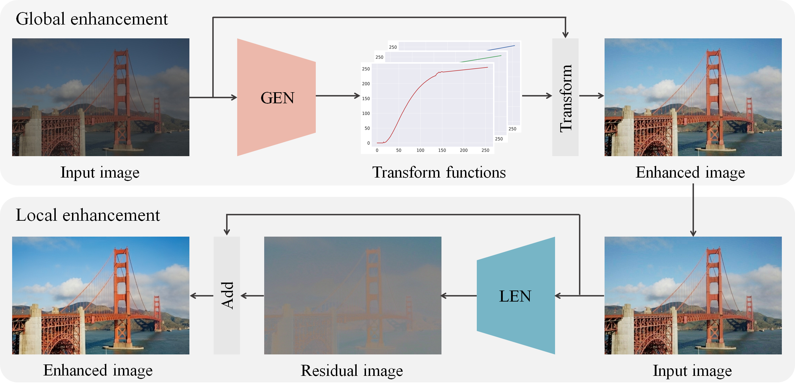

# [ECCV 2020] Global and Local Enhancement Network For Paired and Unpaired Image Enhancement

<div align="center">
  
</div>

<br/><br/>

## Enviroment setup
Our code is developed TensorFlow v2.2 See requirements.txt for all prerequisites, and you can also install them using the following command.

```
pip install -r requirements.txt
```

## Paired Image Enhancement

## Unpaired Image Enhancement
